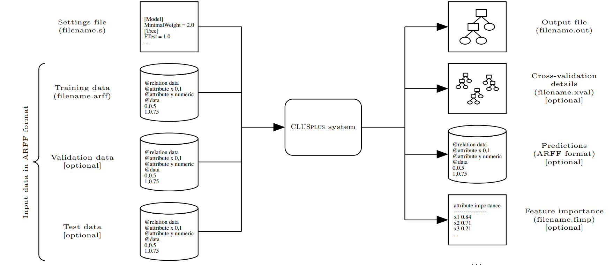

# CLUS+ Software from Department of Knowledge Technologies, Jožef Stefan Institute, Ljubljana, Slovenia.

CLUS+ is a decision tree and rule induction software that implements the predictive clustering framework.
This framework combines clustering with predictive modelling and allows for a natural extension to more complex prediction tasks. 

CLUS+ is able to solve tasks such as (hierarchical) multi-label classification, (hierarchical) multi-target regression, network regression, and tasks with even more complex output types such as tuples and sets. In addition to this, ensemble learning, feature ranking and semi-supervised learning methods are also included. 

The software is written in the Java programming language and it is available as a standalone command line tool.

The developer documentation is available at: [https://knowledge-technologies.github.io/clus](https://knowledge-technologies.github.io/clus) 

### Installation

To successfully build the CLUS+ codebase, Java 1.8 JDK (JRE is enough for running the built jar file) and Apache Maven 3.6 or newer must be installed. 

To build CLUS+, first git clone this repository or download the zip file:

```
git clone https://github.com/knowledge-technologies/clus.git
```

Second, navigate to the folder containing the `pom.xml` file:

```
cd ClusProject

```

And third, build the code using `maven`:

```
mvn clean package
```

When the build process finishes, the executable .jar file will be in the `./target` folder. In order to verify that the .jar works properly, run the following command:

```
java -jar target/clus-<version>-deps.jar
```

Running the jar file without any command-line parameters displays a short help message and terminates CLUS+. Once built, the executable jar file can be copied and used on any computer with an appropriate Java JRE (or JDK).
 
### Running CLUS+

CLUS+ requires at least two input files (see also Figure below): 
1. A settings file (e.g., filename.s) in the form of an [INI config file](https://en.wikipedia.org/wiki/INI_file) 
2. A dataset file in the [attribute-relation file format](https://www.cs.waikato.ac.nz/~ml/weka/arff.html) (.arff).



The parameters for machine learning algorithms and path to the `.arff` dataset(s) are specified in the settings `.s` file, while additional command-line switches are used to drive the behavior of the software. For example, `-xval` switch is used to perform cross-validation or `-ssl` to perform semi-supervised learning. A complete description of the parameters and command-line switches is given in the [user manual](https://github.com/knowledge-technologies/clus/blob/main/ClusProject/docs/manual/clus-manual.pdf).

When the settings file and datasets have been prepared, CLUS+ is executed by the following command:

```
java -jar clus.jar [switches] filename.s
```

CLUS+ writes results to an output file `filename.out`, which contains the values of settings values used for the run, the evaluation metrics, and information about the learned models. The output files are also explained in depth in the [user manual](https://github.com/knowledge-technologies/clus/blob/main/ClusProject/docs/manual/clus-manual.pdf).

 

### Examples

The corresponding settings files and datasets for the examples described below are in the `ClusProject/docs/examples/` folder.  

##### Learning a single decision tree 

This is the most basic and default option of CLUS+. If we simply call

```
java -jar clus.jar example.s
```

from the command line, it takes as input the mentioned settings file and the `example.arff` data file to produce the output in the `example.out`. In the output file, the basic information for the run is specified, e.g., all the values of all the parameters, the list of the models, and some statistics for the run (e.g., induction time and error measures). Three models have been built: the Default (leaf) Model, a fully grown tree (Original Model) and its pruned version (Pruned Model).

The sections `Ensemble` and `SemiSupervised` of the settings file were ignored during this run, because the `-forest` and `-ssl` command-line switches were not used. Note also that there are some other possible sections of the parameter settings `General`, where verbosity level and random seed can be specified), and there are many other parameters in the sections listed above (e.g., `TestSet` in section `Data`). However, since every parameter has its default value, we do not have to list them all in the settings file.

##### Semi-supervised learning of PCTs

In semi-supervised mode, **CLUSplus** can use partially labeled examples (where the values of some of the target variables are unknown) or unlabeled examples (where the values of all of the target variables are unknown). Note that the ``exampleSSL.arff`` data file contains such examples in the last four rows (missing values are marked with `?`). To build a PCT in SSL mode, the ``-ssl`` switch needs to be included into the command line. The command: 

```
java -jar clus.jar -ssl exampleSSL.s
```

would result in a single semi-supervised tree (output file `exampleSSL.out`). 

##### Semi-supervised learning of a random forest of PCTs

When growing an ensemble of decision trees, e.g., random forests, we need to include the switch `-forest` in the command line: The command: 

```
java -jar clus.jar -forest -ssl exampleSSL.s
```

produces a random forest of SSL trees (output file `exampleSSLrf.out`). Since the settings also specify that a feature ranking should be computed (`Ensemble.FeatureRanking = Genie3`), we will additionally obtain an `exampleSSLTrees10Genie3.fimp` file where the feature importance values (as calculated by the Genie3 method) are listed.

### User manual

User manual with detailed instructions of use and descriptions of all parameters and functionalities is available here: [https://github.com/knowledge-technologies/clus/blob/main/ClusProject/docs/manual/clus-manual.pdf](https://github.com/knowledge-technologies/clus/blob/main/ClusProject/docs/manual/clus-manual.pdf) 
